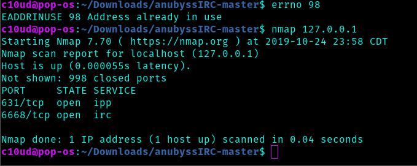

# AnubyssIRC

Internet Relay Chat server Daemon
(IRCD)
## Overview
This IRC Daemon is made to run on several machines that are connected to the internet. Each server exists for the execution of two tasks, the first is the relaying of messages across channels. The second is to accept commands from the controller. Commands sent by the controller are directly passed from the server's kernel, allowing the full configuration of a server device. This server runs in a zombie loop to prevent the server process from being killed when it is listening. This means the server can only be killed while it is recieving data (not in seep/zombie state) or by itself (when the program autonomously exits the zombie loop)
 

    

### References
Server loop: https://ncona.com/2019/04/building-a-simple-server-with-cpp/
 
Zombie loop: https://en.wikipedia.org/wiki/Zombie_process
 
